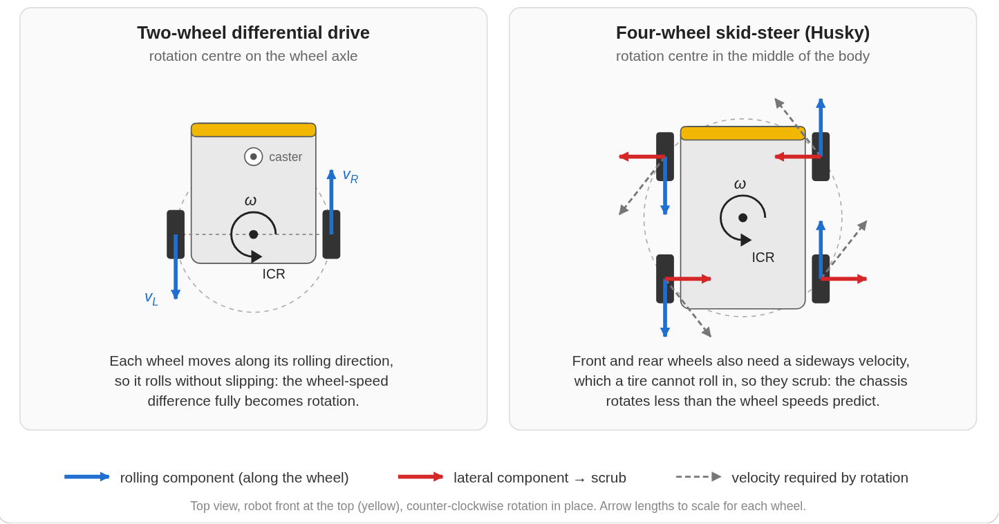
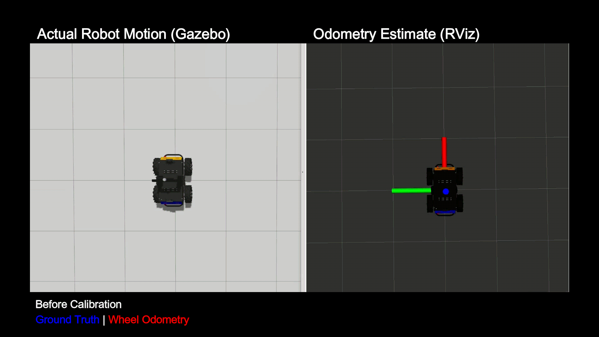
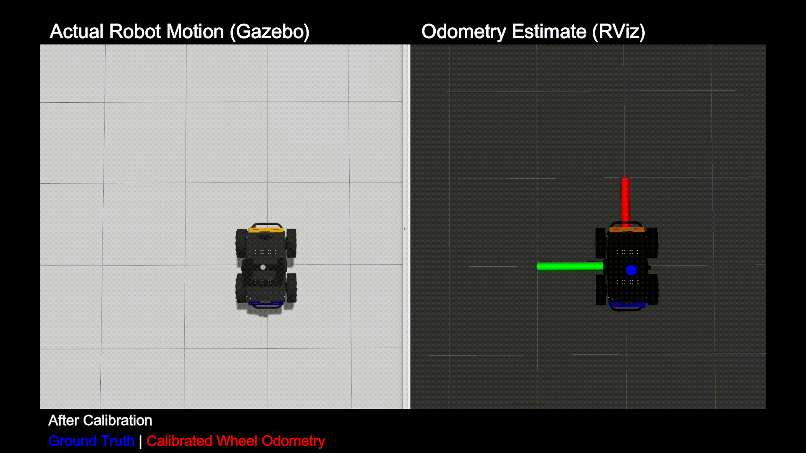
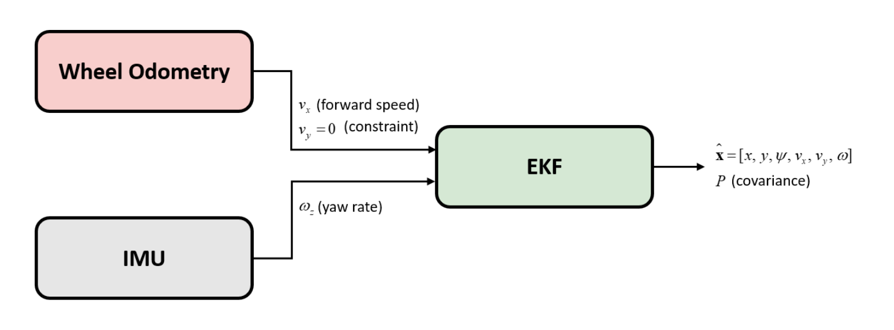
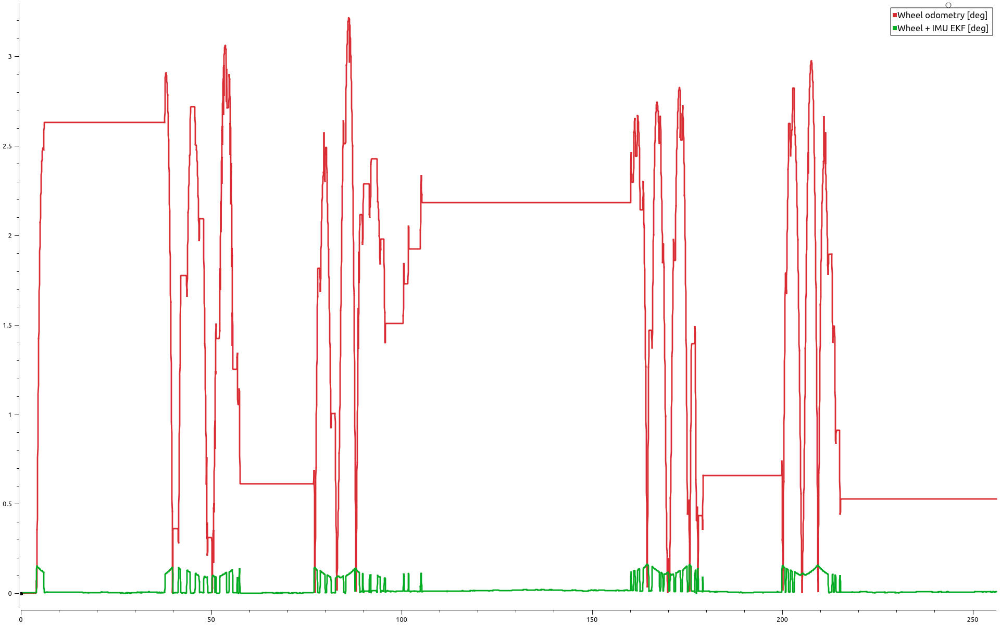
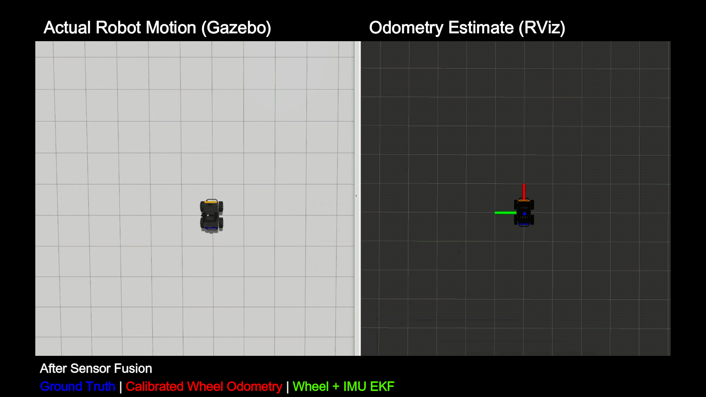
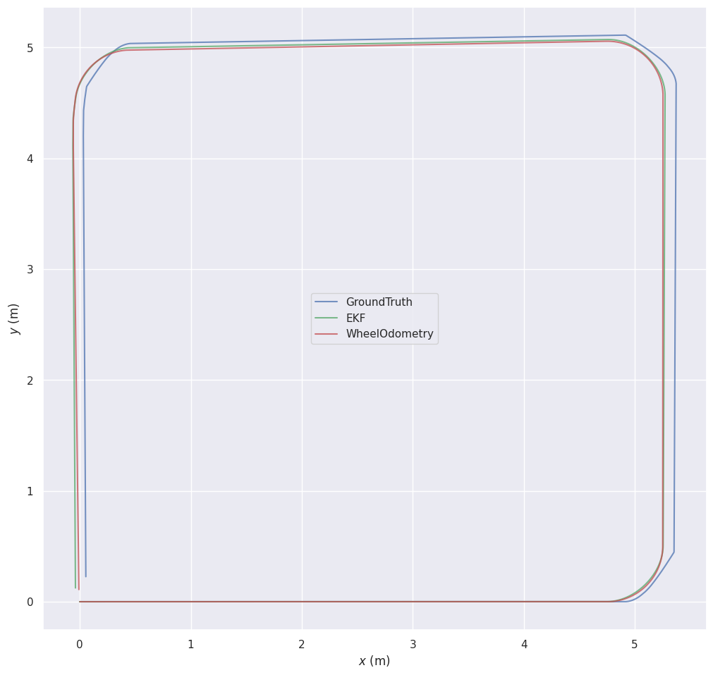
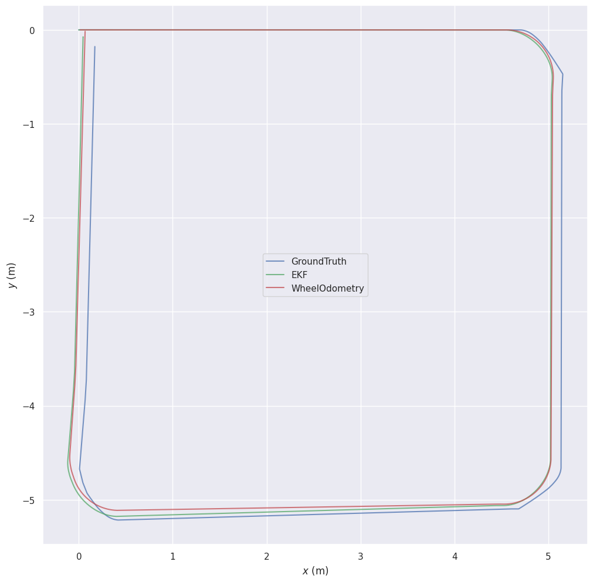
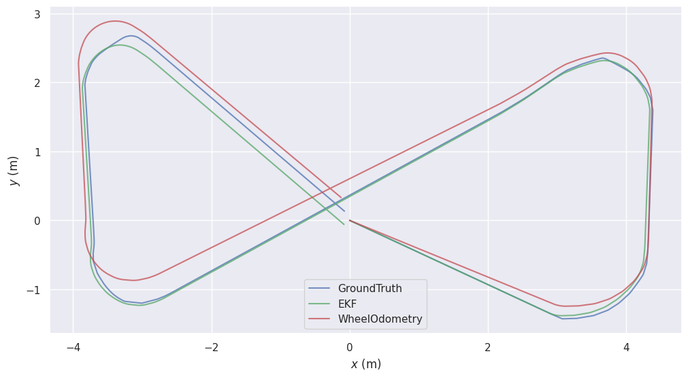
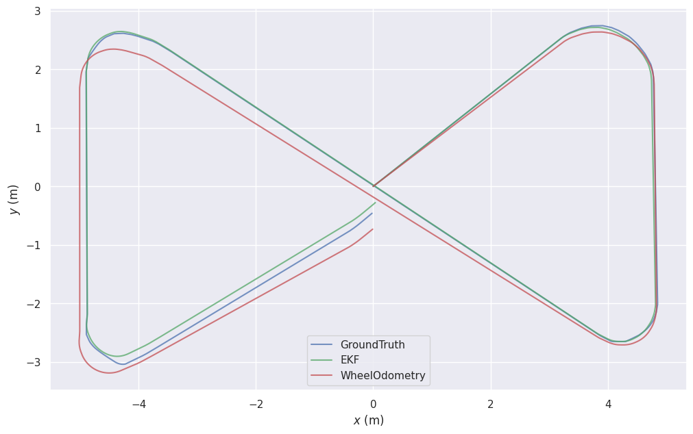

# Husky UGV Odometry: Calibration, Sensor Fusion, and Benchmarking

Localization & State Estimation module of [Husky UGV Autonomy](https://github.com/SaeidAbdollahi/husky-ugv-autonomy), built with **ROS 2**, **Gazebo**, and **robot_localization**.

Local odometry estimates the robot's motion by integrating wheel and inertial measurements over time. Because each pose is built on the previous one, small errors accumulate into **drift**: the estimated trajectory slowly diverges from the true motion, and the error propagates to every module that depends on the robot's pose, from mapping to navigation.

This module investigates drift on a simulated Clearpath Husky, a four-wheel **skid-steer UGV**. It first identifies a major source of odometry error, a **kinematic-model mismatch** caused by tire scrub during turns, and corrects it through **wheel-odometry calibration**. It then applies **sensor fusion**, combining IMU yaw rate with wheel odometry in an **Extended Kalman Filter (EKF)** to further reduce heading drift. Both steps are evaluated with **ground-truth benchmarking** (APE/RPE with evo).

The work follows a **root-cause analysis** workflow:

1. **Observe:** wheel odometry diverges from ground truth during turns, but not on straight segments.
2. **Isolate:** six in-place rotation trials show a repeatable ~56% yaw overestimate from the skid-steer model mismatch.
3. **Correct:** calibrate the effective track width (`wheel_separation_multiplier: 1.558`).
4. **Fuse:** add IMU yaw rate in an EKF to reduce the remaining heading drift.
5. **Benchmark:** evaluate both estimators against ground truth with APE/RPE on four trajectories.

On **Figure-8 trajectories**, the EKF reduces **global position error by about 55%** and **heading error by about 97%** compared with calibrated wheel odometry (simulation). The improvement comes from a better direction of motion, not a better distance: the gyroscope corrects the heading, while the travelled distance still comes from the wheels. The result is a more accurate local odometry baseline, but one that **still drifts**. Bounding that error is the motivation for the next modules: **mapping and localization**.

## Table of contents
- [How Wheel Odometry Works on a Skid-Steer Robot](#how-wheel-odometry-works-on-a-skid-steer-robot)
  - [Straight Driving and Turning](#straight-driving-and-turning)
  - [Model Limitations](#model-limitations)
  - [Observed Failure: Rotation Overestimated in Turns](#observed-failure-rotation-overestimated-in-turns)
- [Wheel Odometry Calibration](#wheel-odometry-calibration)
- [Wheel + IMU Sensor Fusion with an EKF](#wheel--imu-sensor-fusion-with-an-ekf)
  - [Filter Inputs and Outputs](#filter-inputs-and-outputs)
  - [State-Space Model and Filter Equations](#state-space-model-and-filter-equations)
  - [Initial Values and Noise Parameters](#initial-values-and-noise-parameters)
  - [Filter Output and Reduced Heading Error](#filter-output-and-reduced-heading-error)
  - [Effect of Fusion on the Trajectory](#effect-of-fusion-on-the-trajectory)
- [Benchmarking](#benchmarking)
  - [Test Runs and Data Collection](#test-runs-and-data-collection)
  - [Evaluation Settings](#evaluation-settings)
- [Results](#results)
- [Limitations](#limitations)
- [Conclusion](#conclusion)
- [Next Steps](#next-steps)
- [About the Author](#about-the-author)
- [License](#license)


## How Wheel Odometry Works on a Skid-Steer Robot

<p align="center">
  <br>
  <em>In-place rotation: the left and right sides are driven at equal and opposite speeds
  (v<sub>L</sub> = −v<sub>R</sub>), so v = 0 and the robot only rotates. The wheels must scrub sideways to turn the chassis.</em>
</p>

The Husky has two driven wheels per side and no steering. It turns by driving the left and right sides at different speeds, so its planar motion can be described with **differential-drive kinematics**. The ROS 2 `diff_drive_controller` averages the front and rear wheel on each side into one virtual left and one virtual right wheel.

From the wheel angular velocities $\dot\varphi_L$ and $\dot\varphi_R$ measured by the encoders, with wheel radius $r$ and wheel separation $b$:

```math
v_L = r\,\dot\varphi_L,
\qquad
v_R = r\,\dot\varphi_R,
```

```math
v = \frac{v_R + v_L}{2},
\qquad
\omega = \frac{v_R - v_L}{b},
```

where $v$ is the forward speed and $\omega$ the yaw rate of the robot. These velocities are integrated into the robot pose $(x, y, \psi)$ in the `odom` frame:

```math
\dot{x} = v \cos\psi,
\qquad
\dot{y} = v \sin\psi,
\qquad
\dot{\psi} = \omega .
```

This is **dead reckoning**: each pose is computed from the previous one, so the estimate is locally smooth but drifts without bound unless it is corrected by an absolute reference such as map-based localization, SLAM, or GNSS.

The model also relies on a key assumption: **the wheels roll without slipping sideways**. A skid-steer robot cannot turn without violating it, which is where the odometry starts to fail.

### Straight Driving and Turning

This section shows how the differential-drive equations describe the robot's motion, and where they stop matching a skid-steer robot.

- **Driving straight:** Both sides are driven at the same speed ($v_R = v_L$), so $\omega = 0$ and the robot moves forward without rotating. The wheel separation $b$ has no effect.

- **Turning:** The left and right sides are driven at different speeds, and the model assumes the entire speed difference becomes rotation:

```math
\omega = \frac{v_R - v_L}{b}.
```

### Model Limitations

I used simple differential-drive kinematics to describe the motion of our Husky robot, but this simplicity comes with drawbacks.

- In the case of a two-wheel differential-drive robot, the robot rotates about a point on its wheel axle, the instantaneous centre of rotation (ICR). Each wheel's velocity is perpendicular to the axle, which is exactly the direction the wheel rolls, so nothing forces a sideways slide.

- On the Husky, the front and rear wheels sit ahead of and behind the rotation centre. When the chassis rotates, each wheel's velocity has a sideways component pointing across the tire. A tire can't roll in that direction, so it has to **scrub**. As a result, the robot rotates **less** than the model calculates, and wheel odometry **overestimates every turn**.

<p align="center">
  <br>
  <em>Wheel velocities during an in-place rotation: two wheels roll, four wheels scrub.</em>
</p>

Selecting a kinematic model is a design choice. For this odometry module, I chose the simple differential-drive model. The full ICR model, with asymmetric ICRs and a longitudinal offset estimated online, is planned for the vehicle-state and slip-estimation module, where its parameters can adapt to terrain and speed.

### Observed Failure: Rotation Overestimated in Turns

With the default kinematic model, straight driving produced reasonable wheel odometry, but every turn produced a large heading error, which caused a failure in local trajectory estimation.

<p align="center">
  <br>
  <em>Before calibration. Left: the robot in Gazebo. Right: ground truth (blue) and wheel odometry (red) in RViz.
  The wheel model over-counts every turn, so after the first corner the estimated path heads in the wrong direction.</em>
</p>

This matches the limitation described above: the geometric wheel separation is correct, but it no longer represents how the robot actually turns once the tires scrub. To measure this gap, I performed controlled rotation tests and used them to calibrate the model.


## Wheel Odometry Calibration

To estimate the effective track width, I ran a short data-collection experiment. The robot performed six low-speed in-place rotations of about 90°, three counter-clockwise and three clockwise, with the default multiplier $m_b = 1.0$. For each trial, I recorded the yaw change reported by the wheel odometry and compared it with the yaw change from ground truth.

The ratio between the two tells us how much the model overestimates rotation:

```math
k_\psi = \frac{\lvert \Delta\psi_{\mathrm{wheel}} \rvert}{\lvert \Delta\psi_{\mathrm{GT}} \rvert}.
```

Since the yaw computed by the model is inversely proportional to the track width ($\Delta\psi_{\mathrm{wheel}} \propto 1/b_{\mathrm{eff}}$), this ratio is also the factor by which the wheel separation has to be scaled:

```math
m_b^{\mathrm{new}} = m_b^{\mathrm{old}} \, k_\psi,
\qquad
b_{\mathrm{eff}} = m_b \, b .
```

The table below lists the six trials and the effective track width implied by each one. Yaw changes are absolute values, rounded to the precision recorded during the session.

<div align="center">

| Trial | Direction | Δψ GT [rad] | Δψ wheel [rad] | Ratio $k_\psi$ | Implied $b_{\mathrm{eff}}$ [m] |
|:---:|:---:|:---:|:---:|:---:|:---:|
| 1 | Left / CCW | 1.603 | 2.490 | 1.553 | 0.880 |
| 2 | Left / CCW | 1.630 | 2.580 | 1.583 | 0.897 |
| 3 | Left / CCW | 1.620 | 2.560 | 1.580 | 0.896 |
| 4 | Right / CW | 1.620 | 2.510 | 1.549 | 0.878 |
| 5 | Right / CW | 1.580 | 2.450 | 1.551 | 0.879 |
| 6 | Right / CW | 1.660 | 2.560 | 1.542 | 0.874 |

</div>

In every trial, the robot turned about 1.6 rad (~90°), while the wheel odometry reported about 2.5 rad. This is a consistent **~56% overestimate** in both directions, which points to a systematic model error rather than random noise. The difference between the two directions (1.6%) is smaller than the scatter within a single direction, so I treat it as a **symmetric scale error** and use one multiplier for both.

The final value, $m_b = 1.558$, was selected from the unrounded readings and agrees with the mean of the table to within 0.1%. It gives an effective track width of

```math
b_{\mathrm{eff}} = 0.566815 \times 1.558 \approx 0.883\ \mathrm{m},
```

about 56% wider than the geometric one. In other words, the Husky turns like a differential-drive robot with its wheels much farther apart. This behaviour is well known for skid-steer vehicles and is often described by an *expansion factor* (Mandow et al., IROS 2007).

It is important to note that this value is not a property of the robot itself. It depends on the tire–ground contact, the friction model, and the speed range used during calibration, so the model has to be recalibrated whenever these operating conditions change, for example on a different surface or on the physical robot.

<p align="center">
  <br>
  <em>After calibration. Left: the robot in Gazebo. Right: ground truth (blue) and calibrated wheel odometry (red) in RViz.</em>
</p>

With the calibrated multiplier, the wheel odometry now follows the real motion. The turns are no longer over-counted, the estimated path keeps the shape of the ground-truth trajectory, and the robot model in RViz stays aligned with the robot in Gazebo. However, the two paths do not match perfectly. Small heading errors still appear during each turn, because the amount of tire scrub changes with speed and turning radius, and a single constant multiplier can only correct its average effect. Since every new pose is built on the previous one, these small errors keep accumulating over time.

Calibration therefore fixes the model, but it cannot remove drift on its own. Reducing the remaining heading error requires a measurement of rotation that does not depend on the wheels at all. This is the motivation for the next step: fusing the IMU gyroscope with wheel odometry in an **Extended Kalman Filter**.

## Wheel + IMU Sensor Fusion with an EKF

Calibration corrected the average error of the wheel model, but some heading error still remains in every turn. The reason is that the wheels cannot measure rotation independently of the tire scrub: whatever they report is always affected by how much the tires slide on the ground. To reduce this remaining error, I added an **IMU gyroscope** sensor that measures rotation directly, without relying on tire–ground contact.

Because the robot's motion model is nonlinear, the two sources are combined with an **Extended Kalman Filter (EKF)**, using the `robot_localization` package. At each step, the filter predicts the robot's new state from a motion model and then corrects that prediction with the incoming measurements. Each measurement is weighted by its uncertainty, so a precise sensor pulls the estimate more strongly than a noisy one.

### Filter Inputs and Outputs

The filter takes each quantity from the sensor that measures it best. The wheels measure how far the robot moves, so they provide the forward speed $v_x$. The gyroscope measures rotation directly, without depending on tire contact, so it provides the yaw rate $\omega_z$. The wheel odometry also provides $v_y = 0$. This is not a real measurement but a constraint that tells the filter the robot does not slide sideways, which is only approximately true for a skid-steer robot during turns.

<p align="center">
  <br>
  <em>EKF setup: wheel odometry provides the forward speed and the no-sideways-slip constraint, the IMU provides the yaw rate, and the filter outputs the estimated state and its covariance.</em>
</p>

### State-Space Model and Filter Equations

The state vector $\mathbf{x}$ contains the robot's planar pose in the `odom` frame, together with its velocities and accelerations in the body frame:


```math
\mathbf{x} =
\begin{bmatrix}
x & y & \psi & v_x & v_y & \omega & a_x & a_y
\end{bmatrix}^\top
```

**Prediction.** The state is propagated over the time step $\Delta t$ by a nonlinear transition model $f$, which assumes constant acceleration between measurements:

```math
\hat{\mathbf{x}}_k^- = f(\hat{\mathbf{x}}_{k-1}) =
\begin{bmatrix}
x + (v_x \cos\psi - v_y \sin\psi)\,\Delta t + \tfrac12 (a_x \cos\psi - a_y \sin\psi)\,\Delta t^2 \\
y + (v_x \sin\psi + v_y \cos\psi)\,\Delta t + \tfrac12 (a_x \sin\psi + a_y \cos\psi)\,\Delta t^2 \\
\psi + \omega\,\Delta t \\
v_x + a_x\,\Delta t \\
v_y + a_y\,\Delta t \\
\omega \\
a_x \\
a_y
\end{bmatrix}
```

The model is nonlinear because the velocities and accelerations are rotated by the heading $\psi$. There is no angular-acceleration state, so the yaw rate is held constant between updates.

To propagate the uncertainty, $f$ is linearised around the current estimate using its Jacobian $F = \partial f / \partial \mathbf{x}$:

```math
F =
\begin{bmatrix}
1 & 0 & F_{x\psi} & \cos\psi\,\Delta t & -\sin\psi\,\Delta t & 0 & \tfrac12\cos\psi\,\Delta t^2 & -\tfrac12\sin\psi\,\Delta t^2 \\
0 & 1 & F_{y\psi} & \sin\psi\,\Delta t & \cos\psi\,\Delta t & 0 & \tfrac12\sin\psi\,\Delta t^2 & \tfrac12\cos\psi\,\Delta t^2 \\
0 & 0 & 1 & 0 & 0 & \Delta t & 0 & 0 \\
0 & 0 & 0 & 1 & 0 & 0 & \Delta t & 0 \\
0 & 0 & 0 & 0 & 1 & 0 & 0 & \Delta t \\
0 & 0 & 0 & 0 & 0 & 1 & 0 & 0 \\
0 & 0 & 0 & 0 & 0 & 0 & 1 & 0 \\
0 & 0 & 0 & 0 & 0 & 0 & 0 & 1
\end{bmatrix}
```

with

```math
\begin{aligned}
F_{x\psi} &= -(v_x \sin\psi + v_y \cos\psi)\,\Delta t - \tfrac12 (a_x \sin\psi + a_y \cos\psi)\,\Delta t^2 \\
F_{y\psi} &= (v_x \cos\psi - v_y \sin\psi)\,\Delta t + \tfrac12 (a_x \cos\psi - a_y \sin\psi)\,\Delta t^2
\end{aligned}
```

The covariance is then predicted by propagating it through $F$ and adding the process noise $Q$, scaled by the time step:

```math
P_k^- = F\,P_{k-1}\,F^\top + Q\,\Delta t
```

**Measurement models.** The filter receives measurements from two sensors, the wheel encoders and the IMU, and each of them observes a different part of the state. The measurement model is therefore defined separately for each sensor, with its own measurement vector $\mathbf{z}$ and a measurement matrix $H$ that selects the state entries the sensor measures:

```math
\mathbf{z}_{\text{wheel}} =
\begin{bmatrix} v_x^{\text{wheel}} \\ 0 \end{bmatrix},
\qquad
H_{\text{wheel}} =
\begin{bmatrix}
0 & 0 & 0 & 1 & 0 & 0 & 0 & 0 \\
0 & 0 & 0 & 0 & 1 & 0 & 0 & 0
\end{bmatrix}
```

```math
z_{\text{gyro}} = \omega^{\text{gyro}},
\qquad
H_{\text{gyro}} =
\begin{bmatrix}
0 & 0 & 0 & 0 & 0 & 1 & 0 & 0
\end{bmatrix}
```

**Update.** Each sensor message is processed separately: the state is first predicted up to the message's timestamp and then corrected with the standard EKF update, using the sensor's measurement $\mathbf{z}_i$, matrix $H_i$ and noise covariance $R_i$, where $i \in \lbrace \text{wheel},\ \text{gyro} \rbrace$:

```math
\begin{aligned}
\boldsymbol{\nu}_i &= \mathbf{z}_i - H_i\,\hat{\mathbf{x}}_k^- \\
S_i &= H_i\,P_k^-\,H_i^\top + R_i \\
K_i &= P_k^-\,H_i^\top S_i^{-1} \\
\hat{\mathbf{x}}_k &= \hat{\mathbf{x}}_k^- + K_i\,\boldsymbol{\nu}_i \\
P_k &= (I - K_i H_i)\,P_k^-\,(I - K_i H_i)^\top + K_i R_i K_i^\top
\end{aligned}
```


### Initial Values and Noise Parameters

The filter starts with the robot at the origin of the `odom` frame, at rest, and with a very small initial uncertainty, since the starting pose is known exactly. The remaining matrices decide how much the filter trusts its own prediction compared with each sensor: the process noise $Q$ describes how much the state can change unpredictably between steps, and the measurement noise $R$ describes how precise each sensor is.

| Parameter | Value | Source |
|---|---|---|
| Initial state $\mathbf{x}_0$ | $\mathbf{0}$ (robot at the `odom` origin, at rest) | Filter start |
| Initial covariance $P_0$ | $10^{-9}\, I_8$ | `robot_localization` default |
| Process noise $Q$ | $\mathrm{diag}(0.05,\ 0.05,\ 0.06,\ 0.025,\ 0.025,\ 0.02,\ 0.01,\ 0.01)$ | `robot_localization` default |
| Wheel noise $R_{\text{wheel}}$ | $\mathrm{diag}(0.001,\ 0.001)$ | Controller twist covariance |
| Gyro noise $R_{\text{gyro}}$ | $4 \times 10^{-8}$ | Simulated gyro, σ = 2e-4 rad/s |
| Wheel odometry rate | 50 Hz | Controller configuration |
| Filter rate | 50 Hz ($\Delta t = 0.02$ s) | `ekf.yaml` |


### Filter Output and Reduced Heading Error

To see how sensor fusion affects the heading, I drove the robot along a Figure-8 path, which turns continuously in both directions, and compared the heading of the calibrated wheel odometry and of the EKF against ground truth.

<p align="center">
  <br>
  <em>Absolute heading error (degrees) over time (seconds) on the first Figure-8 run. The wheel-odometry error (red) changes only while the robot turns and reaches about 3°. The EKF heading (green), taken from the gyroscope, stays below about 0.15° throughout.</em>
</p>

The wheel heading is disturbed by tire scrub in every turn, while the EKF heading, which does not depend on the wheels, remains almost unaffected. The next section explains why, and what this means for the robot's trajectory.

### Effect of Fusion on the Trajectory

The video below compares the calibrated wheel odometry and the EKF against ground truth on the same run.

<p align="center">
  <br>
  <em>Left: the robot in Gazebo. Right: ground truth (blue), calibrated wheel odometry (red) and wheel + IMU EKF (green) in RViz. On straight segments the three paths run together; the small differences appear after the turns.</em>
</p>

All three paths have the same length on each straight segment, because the distance comes from the wheel odometry in both estimators. They differ only in direction, and only after each turn, where the wheel heading picks up a small error from tire scrub while the EKF heading does not. Since every following pose is built on that heading, even a small error slowly affects the rest of the path. On a short drive like this one the effect is small, but it accumulates over longer trajectories, as the benchmark shows.


## Benchmarking

In this section, I benchmark the calibrated wheel odometry and the EKF against ground truth on four runs, two along a square path and two along a Figure-8 path, using absolute and relative pose error (APE and RPE) as metrics.

### Test Runs and Data Collection

The square is mostly straight driving with four turns, while the Figure-8 turns continuously in both directions and exercises the heading throughout the run. Each path was driven once in each turning direction.

All runs were driven manually by teleoperation at low speed, averaging about 0.1 m/s, and recorded in ROS 2 bags for offline evaluation with evo.

| Run | Path | Turn sequence | Length [m] | Duration [s] |
|---|---|---|---:|---:|
| Square 1 | Square | Four left turns (CCW) | 19.9 | 218 |
| Square 2 | Square | Four right turns (CW) | 19.7 | 215 |
| Figure-8 1 | Figure-8 | In-place rotation CW, then lobes CCW and CW | 24.5 | 255 |
| Figure-8 2 | Figure-8 | In-place rotation CCW, then lobes CW and CCW | 32.4 | 344 |

Lengths and durations are taken from ground truth. In every run, the path length measured by the wheel odometry is within 0.3% of ground truth, which confirms that the wheels measure distance accurately and that the position error comes mainly from the heading.

The figures below show the estimated trajectories of all four runs, with ground truth in blue, calibrated wheel odometry in red and the EKF in green.

| Square 1 (CCW) | Square 2 (CW) |
|---|---|
|  |  |

| Figure-8 1 | Figure-8 2 |
|---|---|
|  |  |

### Evaluation Settings

APE measures how far the estimated trajectory is from ground truth over the whole run, so it captures global drift. RPE measures the error in the motion over each 1 m segment, independent of earlier drift, so it captures local accuracy. Both were computed with evo using the same settings for all runs:

```text
projection:       XY
alignment:        none
scale correction: none
max time offset:  0.05 s
RPE delta:        1 m, pairs from ground truth, all overlapping pairs
```

No alignment is applied: all trajectories start in the same `odom` frame, and a best-fit alignment would remove part of the drift being measured.

## Results

The table below summarises the results for each scenario, averaged over its two runs (RMSE values; two runs per scenario, so no spread is reported).

| Metric (RMSE) | Square: wheel → EKF | Reduction | Figure-8: wheel → EKF | Reduction |
|---|---:|---:|---:|---:|
| APE translation [m] | 0.138 → 0.127 | ~8% | 0.217 → 0.098 | ~55% |
| APE rotation [deg] | 0.74 → 0.04 | ~95% | 1.65 → 0.05 | ~97% |
| RPE translation [m] | 0.043 → 0.039 | ~9% | 0.046 → 0.044 | ~3% |
| RPE rotation [deg] | 1.03 → 0.06 | ~94% | 1.53 → 0.06 | ~96% |

**Heading.** The EKF reduces the rotation error by about 95% in every run, because its heading comes from the gyroscope and is no longer affected by tire scrub.

**Global position.** On the Figure-8 runs, the better heading cuts the global position error (APE) by about 55%. The robot turns continuously there, so the wheel heading error is large, and removing it has a strong effect on the trajectory. On the square runs, the improvement is only about 8%. With only four turns, the wheel heading error is smaller to begin with, and a large part of the remaining position error is an offset at the corners that both estimators share, which fusion cannot correct.

**Local accuracy.** The error over each 1 m segment (RPE translation) barely changes, because both estimators take the travelled distance from the same wheel measurements. This confirms the design of the filter: fusion improves the direction of motion, not the distance.

<details>
<summary><b>Detailed results per run</b></summary>

**APE — translation**

| Run | Wheel RMSE [m] | EKF RMSE [m] | Wheel max [m] | EKF max [m] |
|---|---:|---:|---:|---:|
| Square 1 | 0.127 | **0.118** | 0.208 | **0.185** |
| Square 2 | 0.149 | **0.136** | 0.228 | **0.198** |
| Figure-8 1 | 0.233 | **0.104** | 0.394 | **0.192** |
| Figure-8 2 | 0.201 | **0.092** | 0.352 | **0.190** |

**APE — rotation**

| Run | Wheel RMSE [deg] | EKF RMSE [deg] | Wheel max [deg] | EKF max [deg] |
|---|---:|---:|---:|---:|
| Square 1 | 0.72 | **0.04** | 3.16 | **0.14** |
| Square 2 | 0.77 | **0.04** | 3.27 | **0.31** |
| Figure-8 1 | 1.79 | **0.05** | 2.99 | **0.29** |
| Figure-8 2 | 1.51 | **0.05** | 3.17 | **0.31** |

**RPE @ 1 m — translation**

| Run | Wheel RMSE [m] | EKF RMSE [m] | Wheel max [m] | EKF max [m] |
|---|---:|---:|---:|---:|
| Square 1 | 0.043 | **0.038** | 0.153 | **0.117** |
| Square 2 | 0.044 | **0.040** | 0.162 | **0.126** |
| Figure-8 1 | 0.051 | **0.050** | 0.238 | **0.200** |
| Figure-8 2 | 0.041 | **0.039** | 0.226 | **0.194** |

**RPE @ 1 m — rotation**

| Run | Wheel RMSE [deg] | EKF RMSE [deg] | Wheel max [deg] | EKF max [deg] |
|---|---:|---:|---:|---:|
| Square 1 | 1.00 | **0.06** | 3.07 | **0.16** |
| Square 2 | 1.06 | **0.06** | 3.74 | **0.30** |
| Figure-8 1 | 1.70 | **0.06** | 5.43 | **0.30** |
| Figure-8 2 | 1.36 | **0.06** | 5.40 | **0.36** |

</details>

## Limitations

- **Simulation only.** All tests were run in Gazebo. The calibration value depends on how the simulator models the tires and the ground, so it has to be measured again on the real robot.
- **A perfect gyroscope.** The simulated gyroscope has only small random noise. A real gyroscope also drifts slowly over time, so the heading improvement on the real robot will be smaller.
- **Few, slow test runs.** Each path was driven only twice, by hand and at low speed. The results may differ at higher speeds.
- **An unexplained error at the corners.** On the square runs, both estimators miss the true path at the corners in the same way, and fusion cannot fix it. The cause has not been found yet.
- **Default filter settings.** The filter's noise settings were not tuned for this robot, and the filter assumes the robot never slides sideways, which is not fully true in turns.
- **Drift remains.** The odometry is still built step by step from its own previous estimate, so small errors keep adding up over time.

## Conclusion

The wheel odometry of the skid-steer Husky failed mainly in turns, where tire scrub made the differential-drive model overestimate rotation by about 56%. Calibrating the effective track width removed this systematic error, and fusing the gyroscope yaw rate in an EKF removed most of the remaining heading error. Because the wheels still provide the travelled distance, fusion improved the direction of motion rather than the distance: heading error dropped by about 95% and global position error by up to 55%, while the local error per metre barely changed. The result is a more accurate local odometry baseline, but one that still drifts.

## Next Steps

1. **Investigate the corner offset** on the square runs by checking the ground-truth timing and frame during turns.
2. **Add a realistic gyroscope model** with bias and random walk, and repeat the benchmark.
3. **Validate on the physical Husky**, starting with the rotation calibration and one Figure-8 run.
4. **Estimate slip online** with an ICR-based skid-steer model in the vehicle-state module, instead of a fixed calibration.
5. **Bound the drift** with LiDAR odometry, SLAM and map-based localization, the next modules of [Husky UGV Autonomy](https://github.com/SaeidAbdollahi/husky-ugv-autonomy).

## About the Author

**Saeed Abdollahi** — Robotics Software Engineer

My work focuses on robotics software for autonomous systems, including ROS 2, perception, state estimation, simulation, navigation, and control across wheeled and legged robotic platforms.

I am particularly interested in developing modular and reproducible robotics software that can transition from simulation to real hardware.

Based in Bolzano, Italy, and open to robotics engineering opportunities across Europe.

- 📫 Email: saeed.abdollahi.t@gmail.com
- 💼 LinkedIn: [saeed-abdollahi](https://www.linkedin.com/in/saeed-abdollahi-88467b17a)

## License

Unless otherwise stated, the original content of this repository is Copyright © 2026 Saeed Abdollahi. All rights reserved.

This repository is publicly available for portfolio, research demonstration, and technical documentation purposes. Reuse, modification, redistribution, or commercial use of the original project material requires prior permission.

Third-party software, models, assets, and trademarks remain subject to their respective licenses and ownership terms.